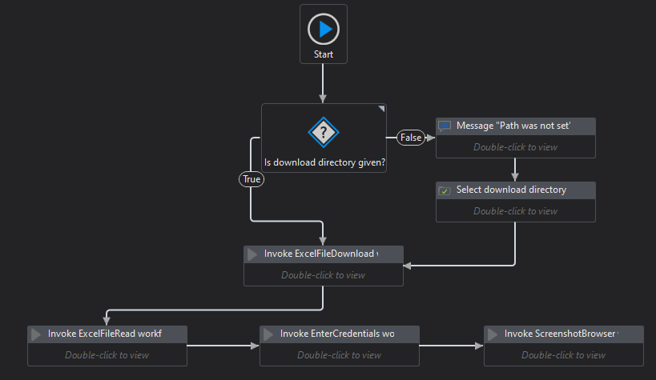

# Rpachallenge.com Automation with UiPath
# Inventory Management practise with UiPath

This project was made during UiPath developer foundation course to learn more about it

# About the robot
The robot downloads the excel file from the website, reads the file and inputs the data into the website's corresponding input boxes. 

